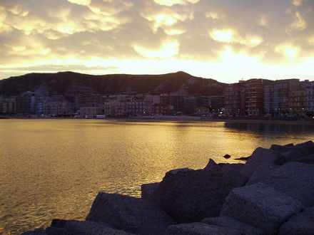

# A Functor Fantasy: Δημοκρατία και Ελευθερία - Chap. 0
（函子异闻录：民主与自由 - 第0章）

Around 495 BCE, Alexandria, Ancient Greece

“我们……在保护着他们，对吗？Iamblichus？”

“是的老师。”

“我……”

“这就是Alexandria港，先生，我们到了。”

“美丽的港口，勤劳的人们。”

“这是自然和人共同的努力啊，老师。”

“Alexandria的人们，对他们面前的生活深信不疑呢。”

“是啊老师，是我们不但保护了他们，还帮助了他们呢。”

“帮助……了嘛？”

“当然老师，您刚做出了一个正确的决定。”

----

Jan. 3rd, 1901, Franklin Institute, Philadelphia  

“从远古的希腊城邦文明，到如今现代全球化的人类分布；从手无寸铁的懵懂时代，到如今蒸汽机车在这广阔的土地上奔腾，人类的发展历程中，科学的发展总是为人类带来了飞跃和新的希望。”

“在座的各位所研究的，与蒸汽和电力一样伟大，你们手中也握有能改变世界的力量。但是，神秘学研究中，曾有一个伟大的人告诉我们不了解真相的公众是神秘学的敌人，他们的无知会抹消超自然现象的力量。”

“但是这是真的吗？公众有权知道真像，不是吗？”

听众席的谈论声渐渐变大了，Tesla知道他的言论引起了议论和反响。但这还不够，他要给旧时代的学术界完美的一击。

“Pythagoras老师，今天我要在这里证明你是错的。”

----

Dec. 29th, 1900, 175 Grand St., The Tesla Laboratories, New York City  

“欢迎，Pero，欢迎来到我的实验室。”

“先生，这样做是违反κανόνες Πυθαγόρεια的，我们不应该……”Tesla的助手在Pero进到会客室之后，对着他的导师和老板说道。

新的The Tesla Laboratories的会客室装修很不平凡。Tesla为了今天的实验特别设计了这间房间。成败在此一举，如果他的助理研究员和他想的是对的，那么从今天起，公众的无知将再也不是超自然力量的毒药或障碍，而将成为它的加速器。而神秘学和超自然现象也将不再是少数人的特权，每个人都将能够享受到它。

Pero坐在会客室中，他注意到了一副画，一副很奇怪的画。

“它叫做‘Berryman-Langford Catalyst Meme’（Berryman-Langford触媒模因），很好看，不是么？”

注视着Pero，暗自里，Tesla低声说道：“**Sie müssen wissen, sie werden wissen.**”

----

